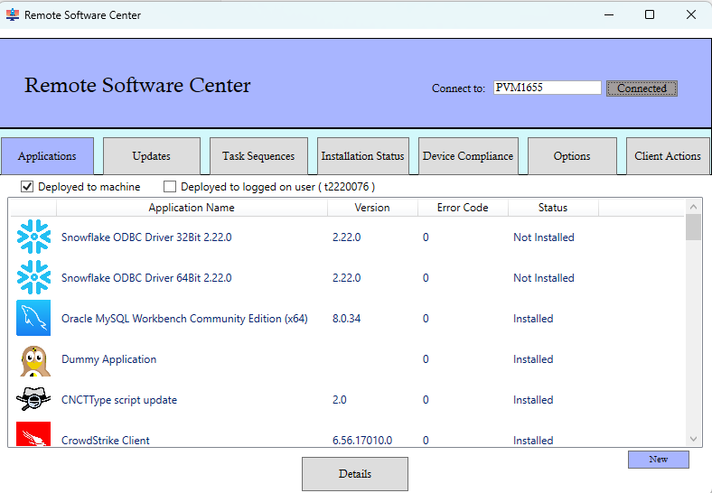

# Remote-Software-Center
## 💚To Support - Venmo - Gregory-Scott-91 💚
This program functions as a comprehensive Remote Software Center, designed to enable system administrators to manage software installations, updates, and task execution remotely on client machines. 

### Features

- **Remote App Management**  
  Install and uninstall applications remotely on client devices.

- **Software Updates**  
  Remotely install and manage software updates across multiple devices.

- **Task Sequences**  
  Trigger and manage task sequences remotely, ensuring seamless deployment and configuration.

- **Work Time Management**  
  Set and manage work hours for client machines remotely, optimizing system usage and performance.

- **Baseline Checks**  
  Run and check baselines to ensure that remote devices comply with organizational policies and standards.

- **Client Actions**  
  Remotely trigger all SCCM client actions.

### Usage

1. Download RemoteSC.exe executable or .ps1 file (executable is just the ps1 wrapped with ps2exe)
2. Run executable or PS1.
3. Enter in remote computer name and click Connect.
4. Remotely administer!
### Requirements

- Need to be a workstation admin on remote workstations you are running the script against.
- Need to have powershell remoting access on remote workstatins. 
